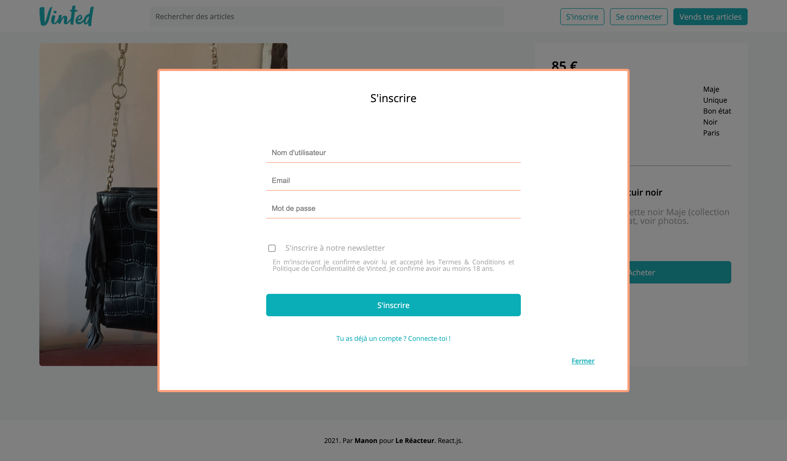
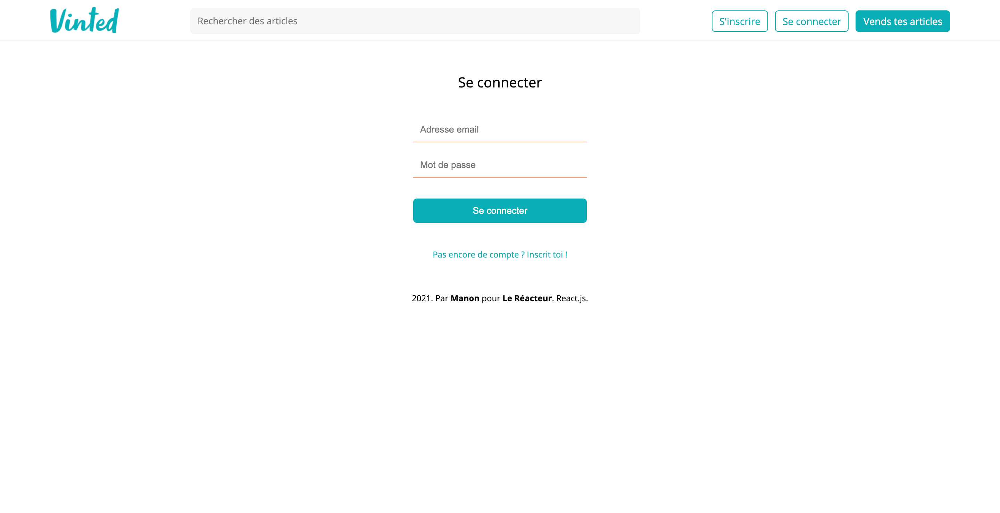
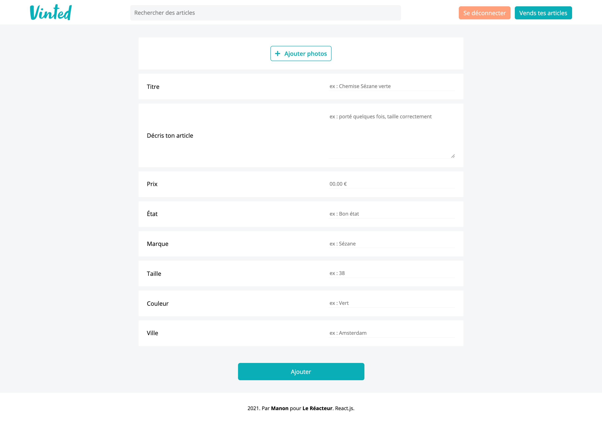
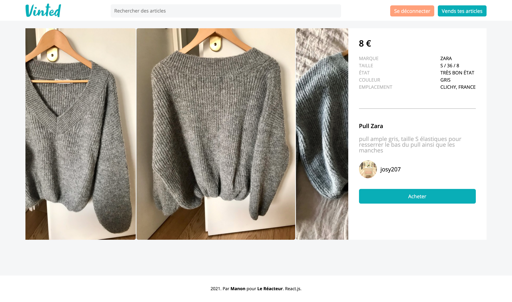

# VINTED CLONE 🎒👗👟

🌤 May 2021  
⚙️ Backend - check the backend [repo](https://github.com/manon-boiteau/vinted-LeReacteur.git)  
✨ Frontend  
🔗 Netlify - check [that](https://myvinted-lereacteur-2021.netlify.app/)

## 🌈 Overview - Welcome dude

---

Vinted clone made at [Le Reacteur](https://www.lereacteur.io/) Bootcamp.  
6 screens are availables: home page, login, signup modal, add a product form, product page and payment page.

## 👩🏻‍💻 Tasks

---

✘ Do integration (CSS and React)  
✘ Implement sign up & login  
✘ Create a carousel  
✘ Implement payment system (Stripe)  
✘ Work on authentication (cookies)  
✘ Make responsive design

## 📚 Stacks

---

[Javascript](https://www.w3schools.com/js/default.asp)  
[ReactJS](https://fr.reactjs.org/docs/getting-started.html)  
[HTML5](https://www.w3schools.com/html/default.asp)  
[CSS3](https://www.w3schools.com/css/default.asp)

## 🔜 To be continued

⇢ Link my own backend to the frontend (at the moment, the backend linked is the one of Le Reacteur)  
⇢ Search bar (not working yet)  
⇢ Page number

## 🗝 Installation and usage

---

Be sure, you have installed all dependencies to run the project.

### 🚙 Running the project

1️. Clone this repository

`git clone https://github.com/manon-boiteau/vinted-front-LeReacteur.git`

`cd vinted-front-LeReacteur`

2️. Install packages

`npm install`  
or  
`yarn`

3️. When installation is complete:

`yarn start`

🙏🏻 Thank you @LeReacteur.
